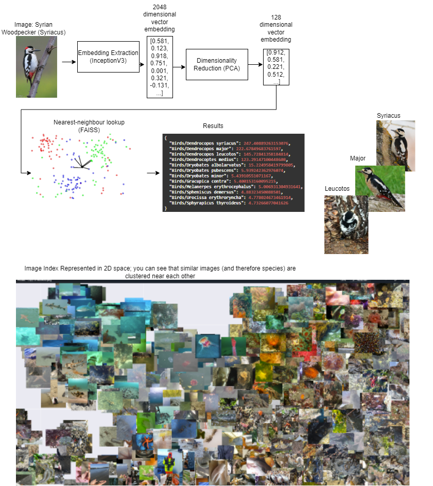

# Image Classifier

## Requirements

- Docker

## QuickStart

To Run the image classifier in docker

1. `cd app`
2. Download volumes by either:
    - (Recommended) Downloading from: <https://drive.google.com/drive/folders/1_MGNzYS1zJol22a4anZKhcycFJlkacM-?usp=sharing>
    and unzip so it follows the directory structure below:
    - Follow the instructions in `download_volume.sh` to download individual directories from the web

    You want your volumes to sit in `app/`; so

    ```dir
    - notebooks/
    - app/
        - volumes/
            - models/
            - tmp/ (This is just an empty directory)
        - src/
        etc..
    ```

    If `app/volumes/tmp/` isn't there, then you can create the dir manually.

3. Build container and run app:

    ```sh
    sh start_docker.sh
    ```

4. Go to `localhost/docs` on a web-browser to access standard swagger; there you can find the endpoints:
    - `/img_url`: which is a generic classifier lookup with 10,000 species
    - `/bird_url`: bird classifier lookup with 964 bird species
    - `/insect_url`: insect classifier lookup with 1021 insect species
    - `/plant_url`: plant classifier lookup with 2101 plant species
    - `/query_gbif/`: to query GBIF API for a species name to get it's Taxon ID

    For each of the first four endpoints, you may make a post request with an image-url from the web to get a result, an example of a curl request is:

    ```sh
    curl -X 'POST' \
    'http://localhost/img_url?img_url=https%3A%2F%2Fwww.allaboutbirds.org%2Fguide%2Fassets%2Fphoto%2F305880301-480px.jpg' \
    -H 'accept: application/json' \
    -d ''
    ```

    which will yield

    ```json
    {
    "Birds/Passer italiae": 163.95316982269287,
    "Birds/Passer hispaniolensis": 105.53175163269043,
    "Birds/Passer domesticus": 94.86506414413452,
    "Birds/Passer melanurus": 75.21808385848999,
    "Birds/Passer diffusus": 46.35168218612671,
    "Birds/Passer montanus": 26.464183807373047,
    "Birds/Agelaioides badius": 24.038153171539307,
    "Birds/Zonotrichia capensis": 13.120645523071289,
    "Birds/Poecile rufescens": 12.39087200164795,
    "Birds/Emberiza spodocephala": 11.550796508789062,
    "Birds/Pinicola enucleator": 8.366301536560059,
    "Birds/Emberiza rustica": 7.7991509437561035,
    "Birds/Quelea quelea": 7.7496466636657715,
    "Birds/Emberiza schoeniclus": 7.556482315063477,
    "Birds/Plocepasser mahali": 6.816717147827148,
    "Birds/Gallus gallus": 6.798619270324707,
    "Birds/Hypsipetes amaurotis": 6.44705057144165,
    "Birds/Regulus regulus": 6.302982807159424,
    "Birds/Artamus leucorynchus": 6.084214687347412,
    "Birds/Saltator aurantiirostris": 6.033130168914795,
    "Birds/Sporophila caerulescens": 6.021721839904785,
    "Birds/Emberiza calandra": 5.970383167266846,
    "Birds/Spermestes cucullata": 5.914627552032471,
    "Birds/Arremonops rufivirgatus": 5.861789226531982,
    "Birds/Vidua macroura": 5.84414005279541,
    "Birds/Vireo bellii": 5.821963787078857,
    "Birds/Junco hyemalis": 5.808008193969727,
    "Birds/Melozone crissalis": 5.805220127105713,
    "Birds/Camptostoma imberbe": 5.790415287017822,
    "Mammals/Rattus norvegicus": 5.742129325866699,
    "Birds/Cinclus mexicanus": 5.713070392608643,
    "Birds/Acridotheres cristatellus": 5.6952900886535645,
    "Birds/Zonotrichia albicollis": 5.5750555992126465,
    "Birds/Zonotrichia querula": 5.553228855133057,
    "Birds/Ploceus philippinus": 5.546966075897217,
    "Birds/Todiramphus sanctus": 5.504706859588623,
    "Birds/Columba livia": 5.5021653175354
    }
    ```

## The Classifier Itself

The bird, insect and plant classifers are 'off the shelf' classifiers from TensorFlow Hub. Our initial goal was to build a generic classifier that could classify up to 10,000 species which is what has been done in the [paper](2017_kaggle_paper.pdf) in this directory. To explore our early work here, you may want to take a look at the `./notebooks/train_model/` directory.

Quickly, we came to realise that training a model can take very long (and there is only so much time until the Hackathon Submission date), especially if we want to reproduce the results; and if we want to expand the number of species that we classify, we would need to retrain the entire model. Instead the approach we ended up with is twofold:

1. Use off-the shelf image classification models provided by [TensorFlowHub](https://www.tensorflow.org/hub), of which you can see our experimental work in `./notebooks/test_TF_Classifiers.ipynb` for groups of species (birds, plants, insects). This can be built upon by:
    - Taking the base-model and fine tuning with custom classes/species.
    - Looking into other models that specialise in classifying specific species and incorporate them.
2. For Generic image search, we wanted a classifier that scales well to large number of classes/species and which you can easily add more species. The two notebooks outline our approach `./notebooks/faiss_experimental.ipynb` and `./notebooks/faiss_lean.ipynb` which is the more streamlined version of the former. We also experimented with varying the models and parameters we used which can be found in `./notebooks/experimental_notes.md`. As an overview, you can recreate our generic classifier with the following method:

    1. Download iNaturalist train_mini dataset; instructions can be found in (`./download_data.sh`) and place in `./data/` directory. This is a dataset with 10,000 species and 50 images of each.

    2. Extract the image embeddings using a iNaturalist 2017 pre-trained [InceptionNetV3](https://tfhub.dev/google/inaturalist/inception_v3/feature_vector/5) model (results in a 2048 dimension vector)

    3. Use [PCA](https://scikit-learn.org/stable/modules/generated/sklearn.decomposition.PCA.html) to reduce 2048 dimensions to 128 dimensions (this makes the next step much faster)

    4. Build Nearest Neighbour Lookup [FAISS](https://github.com/facebookresearch/faiss) index

As you can imagine, being able to produce an accurate classfier for every single species on Earth based on image alone is a huge task, and 10,000 species in just a drop in the ocean. However, our approach does outline one method that can easily be expanded to include more species and is quite scalable in that regard so we look forward to how people may take our idea and evolve it to new levels.

Note/Dicslaimer: As we only have 10,000 species. There is a possibility that the image you want to look up is not included in our index.


### Other directions for improvement

- Explore other image embedding extractors
- Experiment with different FAISS indexes (as a side-note, you can also use GPU to improve image lookup speed)
- Add more iNaturalist images to classify

### Datasets

- More iNaturalist data can be found [here](https://github.com/inaturalist/inaturalist-open-data/tree/documentation/Metadata)
- And GBIF datasets [here](https://www.gbif.org/dataset/search)
