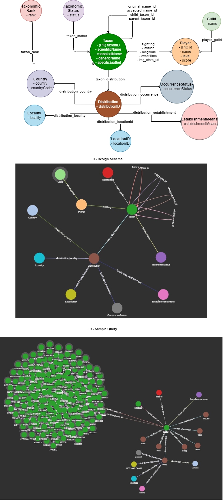

# TigerGraph Database

## Getting Started

The easiest way to get started and re-create our graph is to:

### QuickStart (TG Cloud and Google Colab)

1. Create your own TigerGraph Cloud instance on [TG Cloud](https://tgcloud.io/app/solutions) (We used the free instance for our solution). You can follow this youtube [tutorial](https://www.youtube.com/watch?v=mOsfjst6Ahs)

2. Begin a new [Google Colab Session](https://colab.research.google.com/?utm_source=scs-index) and upload the `UploadGBIF.ipynb` notebook in `./notebooks/`

3. Enter your Hostname, Username and Password of your Graph into the notebook. Then you can can click `Runtime>Run All` to upload the entire dataset, or go through the notebook at your own pace to understand what is happening.

### QuickStart (Local)

Requirements

```sh
Docker
Python >= 3.6
```

And `>10GB of memory free`, Tiger Graph docker instance is very beefy.

#### Steps

1. Download backbone data by running:
    - Linux:

    ```sh
    sh download_backbone_data.sh
    ```

    - Otherwise:

    ```py
    python3 download_backbone_data.py
    ```

2. Follow the steps in `./start_local_tgcloud.sh` to run TigerGraph in your local docker container

3. Install all the requirements in `requirements.txt` by running `pip install -r requirements.txt`. You will also need to install jupyterlab `pip install jupyterlab`

4. Begin a jupyter-notebook instance and open up the `./notebooks/UploadGBIF.ipynb` notebook, changing the `DATA_DIR`, `HOSTNAME`, `USERNAME` and `PASSWORD` variables to where your backbone data is and your local cloud credentials accordignly.

### Schema



## Querying

Now that you have managed to get some data into your Tiger Graph instance, the fun part begins and we can run some queries.

You can run the queries in the notebook `./notebooks/QueryingTG.ipynb` to try the set of queries we have come up with for our v1 App. Of course, you are not limited to these; do go ahead and try some yourselves! We look forward to seeing what you may come up with :).

Alternatively, you can also use Tigergraph's Graph Studio to play around with the graph and queries; you might find this to be more flexible. This set of [tutorials](https://www.youtube.com/watch?v=czbOAG7ITz4&t=2057s) may be very useful.
